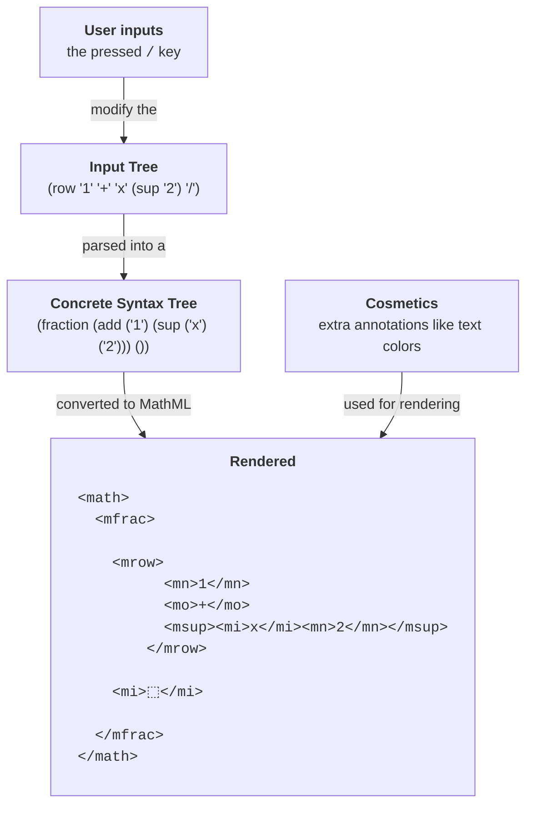

# Contributing Guide

Welcome! Contributions are very welcomed. If you ever feel unsure, please do open an issue.

Preferably, features are developed in another branch or fork. After the feature is ready, a pull request to the main branch should be opened.

## High Level Overview

If the currently entered equation is $1+x^2$, and the user types `/` then

## Tooling

### Prerequisites

- [Node 18 or greater](https://nodejs.org/en/). Don't install Chocolatey.
- A code editor (see below)

### Setup

1. Fork the repository
2. Clone your fork
3. `npm install`
4. `npm run dev`

### Recommended Tooling

I recommend using [Visual Studio Code](https://code.visualstudio.com/) with

- [Rust Analyzer](https://marketplace.visualstudio.com/items?itemName=rust-lang.rust-analyzer) for Rust
- [Prettier Extension](https://marketplace.visualstudio.com/items?itemName=esbenp.prettier-vscode) to format your files
- Settings &rarr; Format On Save &rarr; Enable (`"editor.formatOnSave": true,`)
  - If you are using autosave: Settings &rarr; Autosave &rarr; On Focus Change (`"files.autoSave": "onFocusChange",`)
- [(optional)Error Lens](https://marketplace.visualstudio.com/items?itemName=usernamehw.errorlens) to see all the errors inline with the code
- [(optional)TODO Highlight Extension](https://marketplace.visualstudio.com/items?itemName=wayou.vscode-todo-highlight)

As for settings, I personally am a fan of those "inlay hints".

### Used Technologies and Libraries

The most important ones are

- [Typescript](https://www.typescriptlang.org/) - Typesafe Javascript
- [Rust](https://www.rust-lang.org/) - Safe and productive systems programming language

We are also using

- [Vite](https://github.com/vitejs/vite) - speedy development server and bundler

## Code Structure

- `aftermath-core` is the self-contained Rust library that parses the math formula
- `src/component/math-editor.ts` contains the web component for the mathematical editor
- `src/core` has the aftermath-core parser bindings
- `src/mathml` has the MathML rendering code
- `src/mathml/parsing.ts` has the MathML parsing code
- `src/rendering` has the non-renderer-specific rendering interfaces
- `src/utils` has a few utility functions that I sometimes wish were part of the Javascript standard library
