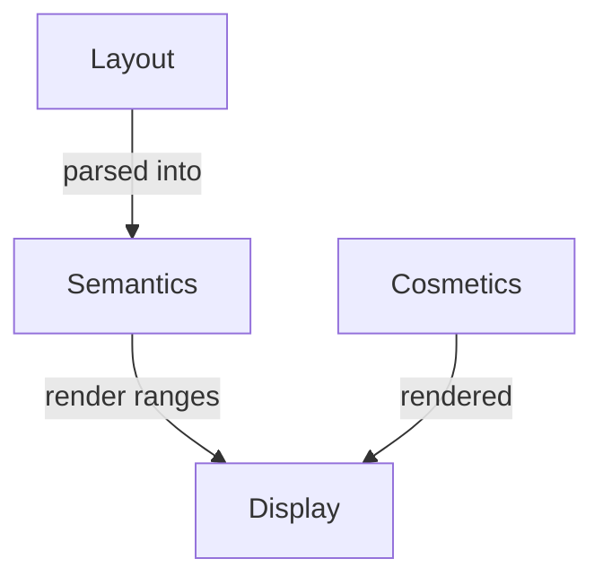

# Aftermath Editor

> A user-first mathematics editor that understands your formulas

This is currently a work-in-progress. See it in action at https://stefnotch.github.io/aftermath-editor

The goals, in order, are
1. Nailing down the semantics of any particular equation. No more guessing how a computer or a fellow human might interpret it.
2. Inputting and editing a formula should be as easy, intuitive and fast as reasonably possible.
3. Beautiful rendering, following the lead of LaTeX and MathML.

Compared to other editors out there, this editor cares about _what your formulas mean_. Since the computer then understands the formulas, it becomes pratical to use this as a next-gen calculator frontend.

TODO:
Explanation of what this is.

Quick explanation of what MathMl is.

MathML essentially lets you put `<math>` tags right into your HTML, and then the browser will display it as a pretty formula.

```mathml
<div>
Oh look, it's a fraction
<math>
  <mn>3</mn>
  <mo>+</mo>
  <mfrac>
    <mn>1</mn>
    <mn>2</mn>
  </mfrac>
</math>
</div>
```

Why is that really nice?

- Fast rendering, browsers are already optimized for taking a tree-structure and rendering it
- Accessibility (MathML defines quite a lot of accessibility stuff)
- Tooling (generating and parsing MathML is easier than generating/parsing LaTeX)

https://news.ycombinator.com/item?id=34331225

## History

MathML is a lovely, but quite massive standard for _rendering_ mathematical formulas on the web.
With the advent of [MathML Core](https://w3c.github.io/mathml-core/#introduction), it has become significantly sleeker, better documented and thus, more interesting for browser vendors. [So the lovely folks at Igalia](https://mathml.igalia.com/) decided to start getting MathML supported in Chromnium! [Here is the current status](https://chromestatus.com/feature/5240822173794304).

My hope is that it'll get ready to ship in the next year(s). Then, having a _formula editor_ that uses MathML for rendering will finally be a perfectly reasonable choice!

## Developer info

Check out the roadmap https://github.com/users/stefnotch/projects/1/views/1

- `src/components/math-editor.ts` contains a web component for the mathematical editor
- `src/math-layout` contains all the code for the representation of what a math formula _looks_ like
- `src/math-editor` is a WIP
- `src/math-editor` is a WIP

- `aftermath-core` contains a Rust package that has to be built and then gets imported by the rest of the code

### Trees

Similar to https://github.com/rust-lang/rust-analyzer/blob/master/docs/dev/syntax.md#design-goals

- `MathLayout`: Green nodes, simply represent the formula's structure like `{ type: "frac", values: [top, bottom] }`. Are immutable, and are built from the bottom up. Could be renamed to `MathStructure`.
  - Categories of nodes include: rows, containers, tables, symbols, text, errors
- `MathLayoutZipper`: Red nodes around it, a wrapper datastructure that keeps track of the parent nodes as you walk down the tree.
  - Also has editing utilities that create a new tree, which try to reuse as many of the green nodes as possible. As an implementation details, this is created lazily/on-demand. This means that they only incur an overhead when you actually use them.
- `MathAst`: An actually parsed representation of the formula, which tries to assign a meaning to each symbol. Like tagging digits as numbers, or taking `|x|` and deciding that it's the absolute value of x.

Sources:

- Eric Lippert explaining red-green trees https://ericlippert.com/2012/06/08/red-green-trees/ , also has a bit of info about "widths"/"ranges"/"absolute positions", just like this https://github.com/rust-lang/rust-analyzer/blob/master/docs/dev/syntax.md#greennode has
- Simple post about red-green trees https://blog.yaakov.online/red-green-trees/
- Roslyn archives https://github.com/KirillOsenkov/Bliki/wiki/Roslyn-Immutable-Trees
- Rust Analyzer https://github.com/rust-lang/rust-analyzer/blob/master/docs/dev/syntax.md

## Structure

- Display: display on screen, keeps references to the layout ranges for editing
- Semantics: computed/parsed, keeps references to the layout ranges
- Layout: core, for editing, user-input
- Cosmetics: like colors or text annotations



### Type Theory

- MathJson -> Typechecking -> Evaluation
- Catch errors before evaluating, like `1 + {1,2,3}` would be "error: cannot add number and set"
- Figuring out the correct _invisible_ operator, like
  - AB with A and B being vectors (vec from A to B)
  - ac with a and b being strings (concat)
  - (\x -> 3x)(x) with (\x -> 3x) being a function (apply)
  - 2x with x being a boring old value (multiply)
- Type inference for arbitrary expressions and functions
- https://en.wikipedia.org/wiki/Logical_framework
- https://en.wikipedia.org/wiki/Dependent_type#First_order_dependent_type_theory
- https://math.andrej.com/2012/11/08/how-to-implement-dependent-type-theory-i/

## References

- [Accessibility](https://www.hawkeslearning.com/Accessibility/guides/mathml_content.html#workNotes)
- [Canonicalize](https://github.com/NSoiffer/MathCAT/blob/main/src/canonicalize.rs)
- Test cases
  - https://github.com/cortex-js/compute-engine/issues/11
  - https://github.com/cortex-js/compute-engine/issues/10
  - https://github.com/cortex-js/compute-engine/issues/13
- Examples
  - https://fred-wang.github.io/TeXZilla/
  - https://fred-wang.github.io/MathFonts/mozilla_mathml_test/
  - https://build-chromium.igalia.com/mathml/torture-test/mathml-torture-test.html
  - https://corpora.mathweb.org/corpus/arxmliv/tex%5Fto%5Fhtml/no_problem
  - https://fred-wang.github.io/TeXZilla/examples/customElement.html
  - https://fred-wang.github.io/MathFonts/
  - https://people.igalia.com/fwang/pell-bigint-mathml/
  - http://eyeasme.com/Joe/MathML/MathML_browser_test.html
- [Mathml operator priority](https://github.com/w3c/mathml/issues/161) and [this](https://www.w3.org/TR/MathML3/appendixc.html)
- [Mathml operators](https://w3c.github.io/mathml-core/#operator-tables)
- https://en.wikipedia.org/wiki/Glossary_of_mathematical_symbols
